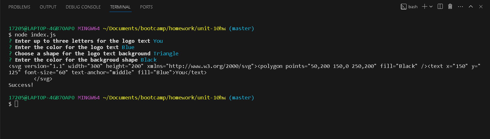
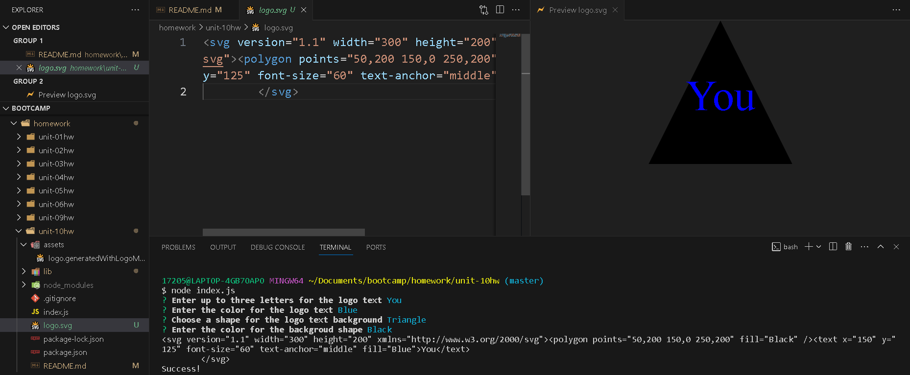

# SVG Logo Maker


## Description
This Node.js command-line application takes in user input to generate a logo and save it as an .svg file. The application is invoked by using the following command:

```bash
node index.js
```

## Screen Shots 





## Links
[GitHub]https://github.com/Matt0Stark/logo_maker

[Application-Walk-Through-Video]https://drive.google.com/file/d/1cZDB053oloKWN8KGKWUB2AP0pb6wSIfg/view?usp=sharing

[Test-Walk-Through-Video]https://drive.google.com/file/d/1ff9QksqhFy14H-85_-VaNagQXkmIdmlN/view


